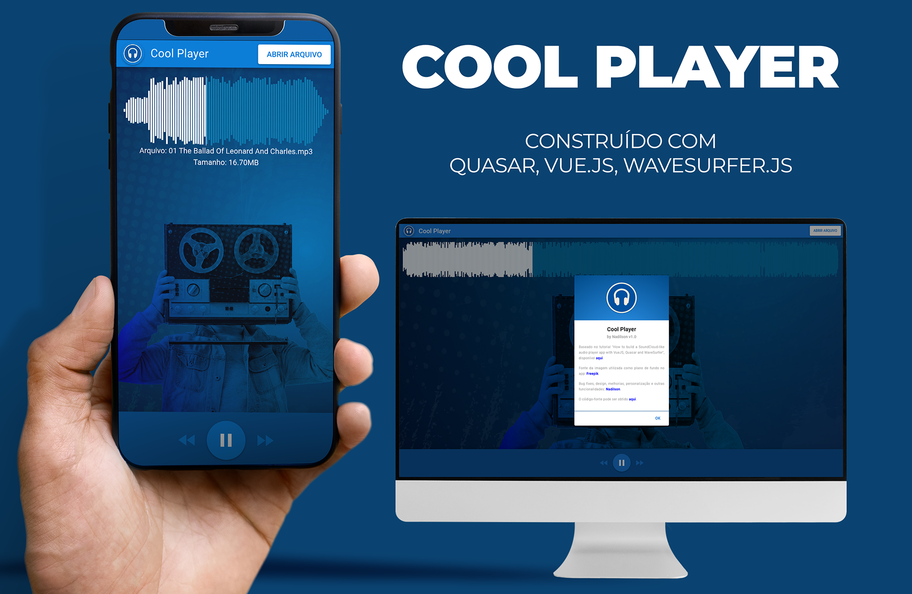

# Cool Player by Nadilson (quasar-wavesurfer-audio-player)

Um reprodutor de áudio semelhante ao SoundCloud usando Quasar e Wavesurfer.

A SoundCloud-like audio player using Quasar and Wavesurfer.



## Descrição em português

App criado seguindo o tutorial intitulado "How to build a SoundCloud-like audio player app with VueJS, Quasar and WaveSurfer", disponível neste endereço: https://www.learningsomethingnew.com/how-to-build-a-sound-cloud-like-audio-player-app-with-vue-js-quasar-and-wave-surfer.

Quasar é uma estrutura de interface do usuário construída em Vue.js.

Várias melhorias, compatibilidade com Vue.js v3 e outras adaptações foram realizadas por mim.

Imagem de fundo foi adaptada de arquivo obtido no seguinte endereço: https://www.freepik.com/free-psd/indie-music-festival-banner-template_14568719.htm.

## Description in English

App created following the tutorial entitled "How to build a SoundCloud-like audio player app with VueJS, Quasar and WaveSurfer", available at this address: https://www.learningsomethingnew.com/how-to-build-a-sound-cloud-like-audio-player-app-with-vue-js-quasar-and-wave-surfer.

Quasar is a UI framework built on Vue.js.

Various improvements, compatibility with Vue.js v3 and other adaptations were made by me.

Background image was adapted from a file obtained from the following address: https://www.freepik.com/free-psd/indie-music-festival-banner-template_14568719.htm.

## Para instalar as dependências

## Install the dependencies

```bash
yarn
# or
npm install
```

### Para iniciar o aplicativo em modo de desenvolvimento (recarregamento de código ativo, relatório de erros etc.)

### Start the app in development mode (hot-code reloading, error reporting, etc.)

```bash
quasar dev
```

### Para executar o aplicativo no SO Android (celular deve estar conectado ao PC via USB)

## Run the app on Android OS (mobile device must be connected to PC via USB)

```bash
quasar dev -m android
```

### Para executar o aplicativo no iOS (celular deve estar conectado ao PC via USB)

## Run the app on iOS (mobile device must be connected to PC via USB)

```bash
quasar dev -m ios
```

### Para analisar os arquivos (busca por erros)

### Lint the files (search for errors)

```bash
yarn lint
# or
npm run lint
```

### Para formatar os arquivos

### Format the files

```bash
yarn format
# or
npm run format
```

### Para compile o aplicativo para produção

### Build the app for production

```bash
quasar build
```

### Para personalizar a configuração

### Customize the configuration

Consulte [Configurando o quasar.config.js](https://v2.quasar.dev/quasar-cli-webpack/quasar-config-js).

See [Configuring quasar.config.js](https://v2.quasar.dev/quasar-cli-webpack/quasar-config-js).

### 😊 Encontre-me

### 😊 Find me

<p align="center">
<a href="https://nadportfolio.vercel.app/"></a>
<a href="https://www.linkedin.com/in/nadilson-teixeira/"></a>
<a href="mailto:nadilson.ads@gmail.com"></a>
<a href="https://instagram.com/nadilsondev"></a>
<a href="https://twitter.com/nadilsondev"></a>
</p>
